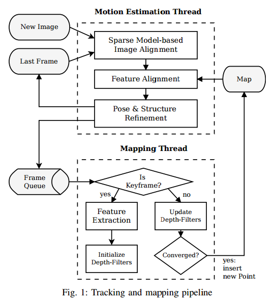

- Semi-direct monocular VO
- Operates directly on pixel intensities rather than features
- Probabilistic mapping method
- 55 fps on Odroid U2 (ARM 1.6Ghz), 300 fps on laptop (Intel i7, 8 cores,
  2.8Ghz)
- Did not have metric comparing the PTAM vs SVO to ground truth, alot of the
  focus was just saying we are faster than PTAM and had plots to show it
  tracked the ground truth better.

Methods that simultaneously recover camera pose and scene structure from
video can be divided into two classes:

- **Feature based**: extract sparse salient image features in each image, match
  them in successive frames using invariant feature descriptors, robustly
  recover both camera motion and structure using epipolar geometry,
  finally refine the pose and structure through reprojection error
  minimization. Disadvantage includes reliance on detection and matching
  thresholds necessary for robust estimation.
- **Direct methods**: estimate structure and motion directly from intensity
  values in the image. The local intensity gradient magnitude and direction is
  used in the optimization compared to feature based methods that consider
  only distance to some feature location. Direct methods that exploit all
  the information in the image, even from areas where gradients are small
  have been shown to outperform feature-based methods in terms of
  robustness in scenes with little texture or in the case of camera
  defocus and motion blur. The computation of the photometric error is
  more intensive than the reprojection error, as it involves warping and
  integrating large image regions. However, since direct methods operate
  directly on the intensity values of the image, the time for feature
  detection and invariant descriptor computation can be saved.

The motion estimation thread implements semi-direct approach to relative
pose estimation. The first step is pose initialization through **sparse
model based image alignment**: the camera pose relative to the previous
frame is found through minimizing the photometric error between pixels
corresponding to the projected location of the same 3D points. The 3D
coordinates corresponding to the reprojected points are refined in the
next step through alignment of the corresponding feature patches. Motion
estimation concludes by refining the pose and the structure through
minimizing the reprojection error introduced in the previous feature
alignment step.

In the mapping thread, a probabilistic depth filter is initialized for
each 2D feature for which the corresponding 3D point is to be estimated.
New depth filters are initialized whenever a new keyframe is selected in
regions of the image where few 3D to 2D correspondences are found. The
filters are initialized with a large uncertainty in depth. At every
subsequent frame the depth estimate is updated in a Bayesian fashion. When
a depth filter's uncertainty becomes small enough, a new 3D point is
inserted in the map and is immediately used for motion estimation.
