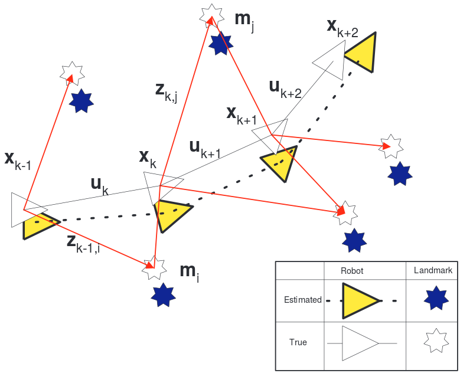

# SLAM

In robotic mapping, simultaneous localization and mapping (SLAM) is the
computational problem of constructing or updating a map of an unknown
environment while simultaneously keeping track of an agents location within
it. While this initially appears to be a chicken-and-egg problem there are
several algorithms known for solving it, at least approximately, in tractable
time for certain environments.

Consider a mobile robot moving through an environment taking relative
observations of a number of unknown landmarks using a sensor located on the
robot. At a time instant $k$, the following quantities are defined:

- $x_{k}$: State vector describing the pose and more of the robot
- $u_{k}$: Control vector applied at time $k - 1$ to drive the robot to a state
  $x_k$ at time $k$.
- $m_{i}$: A vector describing the location of the $i^{\text{th}}$ landmark
  whose true location is assumed time invariant.
- $z_{ik}$: An observation taken from the vehicle of the location of the
  $i^{\text{th}}$ landmark at time $k$. When there are multiple landmark
  observations at any one time or when the specific landmark is not relevant to
  discussion, the observation will be written simply as $z_{k}$.

In addition the following sets are also defined:

- $X_{0:k} = {x_{0}, x_{1}, ..., x_{k}} = {X_{0:k - 1}, x_{k}}$: History of
  robot locations
- $U_{0:k} = {u_{0}, u_{1}, ..., u_{k}} = {U_{0:k - 1}, u_{k}}$: History of
  control inputs
- $m = {m_{1}, m_{2}, ..., m_{n}}$: Set of all landmarks
- $Z_{0:k} = {z_{0}, z_{1}, ..., z_{k}} = {Z_{0:k - 1}, z_{k}}$: Set of all
  landmark observations

The most important insight in SLAM was to realize that the correlations between
landmark estimates increase monotonically as more and more observations are
made. Practically, this means that knowledge of the relative location of
landmarks always improves and never diverges, regardless of robot motion. In
probabilistic terms, this means that the joint probability density on all
landmarks $P(m)$ becomes monotonically more peaked as more observations are
made.

This convergence occurs because the observations made by the robot can be
considered as "nearly independent" measurements of the relative location
between landmarks. Relative location of observed landmarks is independent of
the coordinate frame of the robot and successive observations from this fixed
location would yield further independent measurements of the relative
relationship between landmarks. The term "nearly independent" measurement is
appropriate because the observation errors will be correlated through
successive vehicle motions.

## Anatomy of Modern SLAM Systems
The architecture of a SLAM system includes two main components: the
**front-end** and the **back-end**. The front-end abstracts sensor data into
models that are amenable for estimation, while the back-end performs the
inference on the abstracted data produced by the front-end.

### Types of Front-End

- **Feature-Based Methods**: Fundamental idea behind feature-based approaches
  (both filtering-based and keyframe-based) is to split the overall problem of
  estimating geometric information from images into two steps. First, a set of
  feature observations is extracted from the image. Second, the camera position
  and scene geometry is computed as a function of these feature observations
  only.

  While this decouping simplifies the overall problem, it comes with an
  important limitation: Only information that conforms to the feature type can
  be used. In particular, when using keypoints, information contained in
  straight or curved edges is discarded. Several approaches have been made in
  the past to remedy this by including edge-based or even region based
  features. Yet since the estimation of the high-dimensional feature space is
  tedious, they are rarely used in practice. To obtain dense reconstructions,
  the estimated camera poses can be used to subsequently reconstruct dense
  maps, using multiview stereo.

- **Direct Methods**: Direct visual odometry (VO) methods circumvent this
  limitation by optimizing the geometry directly on the image intensities,
  which enables using all information in the image. In addition to higher
  accuracy and robustness in particular in environments with little keypoints,
  this provides substantially more information about the geometry of the
  environment, which can be very valuable for robotics or augmented reality
  applications.

  While direct image alignment is well-established for RGB-D or stereo sensors,
  only recently monocular direct VO algorithms have been proposed. In
  semi-dense depth filtuering formulation was proposed which significantly
  reduces computational complexity, allowing real-time operation on a CPU and
  even on a modern smartphone. By combining direct tractking with keypoints,
  high frame rates can be achieved on embedded systems. All these approaches
  hoever are pure visual odometries, they only locally track the motion of the
  camera and do not build a consistent, global map of the environment including
  loop closures.

#### Direct vs Indirect

Underlying all formulations is a probabilistic model that takes noisy
measurements $Y$ as input and computes an estimator $X$ for the unknown,
hidden model parameters (3D world model and camera motion). Typically
a Maximum Likelihood approach is used, which finds the model parameters
that maximize the probability of obtaining the actual measurements.

Indirect methods then proceed in two steps. First raw sensor measurements
are pre-processed to generate an intermediate representation, solving part
of the overall problem such as establishing correspondences. Second, the
computed intermediate values are interpreted as noisy measurements $Y$ in
a probabilistic model to estimate geometry and camera motion.

Direct methods skip the pre-processing step and directly use the actual
sensor values - light received from a certain direction over a certain
time period - as measurements $Y$ in probabilistic model.

In the case of passive vision, direct approach thus optimizes
a photometric error, since the sensor provides photometric measurements.
Indirect methods on the other hand optimize a geometric error, since the
pre-computed values point-positions or flow-vectors are geometric
quantities.

#### Dense vs Sparse

Sparse methods use and reconstruct only a selected set of independent
points (traditionally corners), whereas dense methods attempt to use and
reconstruct all pixels in the 2D image domain. Intermediate approaches
(semi-dense) refrain from reconstructing the complete surface, but still
aim at using and reconstructing a (large connected and well-constrained)
subset.

Apart from the extent of the used image region however, a more fundamental
and consequential difference lies in the addition of a geometry prior. In
the sparse formulation, there is no notion of neighborhood, and geometry
parameters (keypoint positions) are conditionally independent given the
camera poses & intrinsics. Dense (or semi-dense) approaches on the other
hand exploit the connectedness of the used image region to formulate
a geometry prior, typically favouring smoothness. In fact, such a prior is
necessarily required to make a dense world model observalbe from passive
vision alone.

- Sparse + Indirect: Most widely used formulation, estimating 3D geometry
from a set of keypoint matches, thereby uisng a geometric error without
a geometry prior. (monoSLAM, PTAM, ORB-SLAM)

- Dense + Indirect: Estimates 3D geometry from or in conjunction with
a dense regularized optical flow field, thereby combining a geometric
error (deviation from the flow field) with a geometry prior (smoothness of
the flow field).

- Dense + Direct: Employs a photometric error as well as a geometric prior
to estimate dense or semi-dense geometry. (DTAM, LSD-SLAM)

- Sparse + Direct: Optimizes a photometric error defined directly on the
images, without incorporating a geometric prior.

## Types of Back-End

- **Pose Graph Optimization**: Well known SLAM technique to build a consistent,
  global map: The world is represented as a number of keyframes connected by
  pose-pose constraints, which can be optimized using a generic graph
  optimization framework like g2o.

### Keyframes
Keyframes are fundamental data structures in SLAM whose fundamental goal is to
provide a primary reference for tracking and triangulation. Each keyframe stores

- 2D image points with corresponding 3D object points
- Feature descriptors (feature-based SLAM) or depth map (direct-SLAM) extracted
  from keyframe image
- Estimated world camera pose
